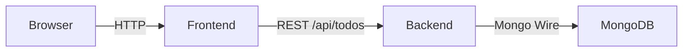

# Reverse Engineering & Lärguide – Kubernetes Todo Platform

**Senast uppdaterad:** 2025-10-07  
**Syfte:** Hjälpa dig förstå hela projektet – från kodbas till Kubernetes/Helm/Argo CD – och ge en konkret studieplan.  
**Målgrupp:** Du som vill lära dig stacken i egen takt, med särskilt fokus på vad som har ändrats senaste sprinten.

---

## 1. Hur du använder dokumentet
1. Läs varje sektion i ordning – var del bygger på tidigare steg.  
2. Följ “Prova själv”-rutorna för att köra kommandon eller inspektera resurser.  
3. Markera vad du vill fördjupa dig i (t.ex. Helm-templating, MongoDB, GitOps).  
4. Gå tillbaka hit när du bygger vidare – dokumentet hålls synkat med koden.

Nyheter i denna version:
- **MongoDB.Driver uppgraderad till 2.27.0** för att passa .NET 9 (fixar AccessViolation).  
- **Frontendens API-hantering** normaliserar URL:er och har gemensam `request`-funktion med felhantering.  
- **Helm values** uppdaterade till explicita image-taggar (`todo-frontend:20251006`, `todo-backend:20251006`) och tom `apiUrl` som triggar `/api`-prefixet.  
- **Dokumentationen** inkluderar tydlig studieplan, korrekta kodutdrag och tips på vidare förbättringar.

---

## 2. Systemöversikt

| Lager | Teknik | Nyckelfiler |
|-------|--------|-------------|
| Frontend | React 18 + TypeScript 5.9, Vite 7 | `app/frontend/src/App.tsx`, `app/frontend/.env`, `app/frontend/nginx.conf` |
| Backend | .NET 9 Minimal API, MongoDB.Driver 2.27.0 | `app/backend/Program.cs`, `app/backend/backend.csproj`, `app/backend/Dockerfile` |
| Databas | MongoDB 7 (körs som Kubernetes Deployment) | Helm values `mongodb`-sektion |
| Infrastruktur | Docker, Helm Chart `helm/cloud-app`, Argo CD GitOps | `helm/cloud-app/*`, `argocd/*.yaml` |
| CI/CD | GitHub Actions (images) + Argo CD (deployment) | `.github/workflows/`, `argocd/application.yaml` |

**Dataflöde:**

- Frontend serveras via nginx (port 80) och anropar `/api/...`.  
- Backend kör på port 8080 och pratar med MongoDB via service-namnet `mongodb`.  
- I dev gör vi `kubectl port-forward` + valfri ngrok-tunnel.

---

## 3. Reposet – vad finns var?

```
projektAppdemo/
├── app/
│   ├── frontend/        # React/Vite-kod + nginx
│   └── backend/         # .NET 9 Minimal API + Mongo
├── helm/cloud-app/      # Helm chart (frontend, backend, mongo)
├── argocd/              # Argo CD application manifests
├── docs/                # Dokumentation (bla denna fil)
├── scripts/             # Hjälpskript (ngrok m.m.)
├── k8s/                 # Rå Kubernetes-manifest (legacy/manual)
└── ... (README, SolutionReport, FailReport, etc.)
```

**Prova själv:**
```bash
ls -R app | head  # snabblista över kodstrukturen
```

---

## 4. Frontend – React + Vite + nginx

### 4.1 Viktiga filer
| Fil | Funktion |
|-----|----------|
| `app/frontend/src/App.tsx` | Hela Todo-logiken, fetch-hantering |
| `app/frontend/.env`        | `VITE_API_URL` (byggs in vid build) |
| `app/frontend/nginx.conf`  | Proxy `/api` → backend + SPA-routing |
| `app/frontend/Dockerfile`  | Multi-stage build (node → nginx) |

### 4.2 App-komponenten (utdrag)
`app/frontend/src/App.tsx:9-45`
```typescript
const rawApiUrl = import.meta.env.VITE_API_URL?.trim() ?? '';
const normalizedBase = rawApiUrl === '' ? '' : rawApiUrl.replace(/\/+$/, '');
const apiUrl =
  normalizedBase === ''
    ? '/api'
    : normalizedBase.endsWith('/api')
    ? normalizedBase
    : `${normalizedBase}/api`;

async function request<T>(path: string, options?: RequestInit): Promise<T | null> {
  const response = await fetch(`${apiUrl}${path.startsWith('/') ? path : `/${path}`}`, options);
  if (!response.ok) {
    const message = await response.text().catch(() => '');
    throw new Error(`Request failed: ${response.status} ${response.statusText}${message ? ` - ${message}` : ''}`);
  }
  if (response.status === 204) return null;
  return (await response.json()) as T;
}
```
**Lärdomar:**
- Vite läser `.env` endast vid build → ändra värde ⇒ kör `npm run build`.  
- Tomt `VITE_API_URL` betyder “använd `/api` på samma origin” (perfekt för nginx-proxy i klustret).  
- `request<T>` centraliserar fetch + felhantering (try/catch i varje CRUD-metod).

### 4.3 CRUD-exempel
- `fetchTodos`: Try-catch, `setTodos(data ?? [])`.  
- `addTodo`: Validerar tom sträng, POST → rensar och laddar om.  
- `toggleTodo`: PUT med togglat `isCompleted`.  
- `deleteTodo`: DELETE → laddar om listan.  
- Console-loggar vid fel hjälper dig felsöka i devtools.

### 4.4 Bygg & kör container
```bash
cd app/frontend
npm install
npm run build
docker build -t ghcr.io/<user>/todo-frontend:<tag> .
```
- nginx-servrar filerna från `/usr/share/nginx/html`.  
- `nginx.conf` proxar `/api/` mot `http://backend:80/api/` i klustret.

---

## 5. Backend – .NET 9 Minimal API + MongoDB

### 5.1 Viktiga delar av `Program.cs`
```csharp
builder.Services.AddCors(options =>
{
    options.AddDefaultPolicy(policy =>
    {
        policy.AllowAnyOrigin().AllowAnyMethod().AllowAnyHeader();
    });
});

var mongoConnectionString = builder.Configuration["Mongo:ConnectionString"] ?? "mongodb://localhost:27017";
...
app.MapGet("/api/todos", async (IMongoCollection<ToDoItem> collection) =>
{
    return await collection.Find(_ => true).ToListAsync();
});
```
- CORS: öppet i dev; begränsa origins i prod.  
- Mongo-connection: läses från konfiguration → fallback lokalt.  
- CRUD-endpoints använder DI: `IMongoCollection<ToDoItem>` injiceras per request.

### 5.2 Dependencies
`app/backend/backend.csproj`
```xml
<ItemGroup>
  <PackageReference Include="Microsoft.AspNetCore.OpenApi" Version="9.0.4" />
  <PackageReference Include="MongoDB.Driver" Version="2.27.0" />
</ItemGroup>
```
- Uppgraderingen löste `AccessViolationException` när appen körs i Kubernetes.  
- Lärdom: ha Dependabot/renovate och kör integrationstest innan deploy.

### 5.3 Köra & testa
```bash
cd app/backend
 dotnet restore
 dotnet run
```
API svarar på http://localhost:5000.  
Snabbtest: `curl http://localhost:5000/api/todos`.

---

## 6. Helm-chart `helm/cloud-app`

### 6.1 Nuvarande values (utdrag)
```yaml
mongodb:
  image: mongo:7

backend:
  image: ghcr.io/andreasvilhelmsson/kubernetes-ci-cd-fullstack-to-do/todo-backend:20251006
  service:
    type: NodePort
    port: 80
    targetPort: 8080
    nodePort: null

frontend:
  image: ghcr.io/andreasvilhelmsson/kubernetes-ci-cd-fullstack-to-do/todo-frontend:20251006
  config:
    apiUrl: ""
```
- `nodePort: null` ⇒ Kubernetes väljer port; kolla med `kubectl -n todo get svc backend`.  
- Tom `apiUrl` + frontendens logik ⇒ `/api`-calls fungerar för både port-forward och ngrok.  
- Mongo saknar PVC i denna version (bra övning att lägga till).

### 6.2 Deploy
```bash
helm upgrade --install cloud-app helm/cloud-app -n todo --create-namespace
kubectl -n todo get pods
```
Efter uppgraderingen ser du pods som `cloud-app-backend-55487566f6-*` (nya RS).

---

## 7. GitOps – Argo CD
- Se `argocd/application.yaml` för hur Helm-charten kopplas till repo + namespace.  
- Aktivera `automated` sync när du är trygg med pipelines.

```bash
kubectl apply -f argocd/application.yaml
argocd app sync cloud-app
```

---

## 8. Dev-miljö: kommandoreferens
| Syfte | Kommando |
|-------|----------|
| Frontend i browser | `kubectl -n todo port-forward svc/frontend 8080:80` → http://localhost:8080 |
| Backend-test | `kubectl -n todo port-forward svc/backend 18082:80` + `curl http://localhost:18082/api/todos` |
| Mongo shell | `kubectl -n todo exec -it deploy/cloud-app-mongodb -- mongosh` |
| Starta ngrok | `./scripts/expose-with-ngrok.sh` eller `ngrok http 8080` |
| Kontrollera pods | `kubectl -n todo get pods -o wide` |

---

## 9. Studieplan – steg för steg
1. **Läs koden** (frontend/back) – förstå hur `request`-funktionen och Minimal API funkar.  
2. **Kör lokalt** utan Kubernetes (dotnet run + npm dev).  
3. **Bygg Docker-images** manuellt och testa containerkörning.  
4. **Helm**: ändra replicas, kör `helm diff upgrade`, deploya.  
5. **Argo CD**: pointa mot ditt repo, observera sync/rollback.  
6. **Observability**: lägg till loggar, metrics, health endpoints.  
7. **Persistens**: migrera Mongo till StatefulSet + PVC.  
8. **Säkerhet**: begränsa CORS, inför NetworkPolicy, hantera secrets med Sealed/External Secrets.

Markera vad du gjort i `SolutionReport` + `FailReport` för att hålla koll.

---

## 10. Förbättringsidéer / TODO
- [ ] Liveness & readiness probes för backend/ frontend.  
- [ ] External Secrets för Mongo credentials.  
- [ ] CI som kör tester + bygger/pushar images.  
- [ ] Grafana dashboard för API latency & Mongo status.  
- [ ] Integrationstest (t.ex. Playwright/k6).  
- [ ] Runbooks för incidenter (se `FailReport.md` som startpunkt).

---

## 11. Snabbkommandon
| Uppgift | Kommando |
|--------|----------|
| Bygg backend | `docker build -t ghcr.io/.../todo-backend:20251006 app/backend` |
| Bygg frontend | `docker build -t ghcr.io/.../todo-frontend:20251006 app/frontend` |
| Push image | `docker push ghcr.io/.../todo-backend:20251006` |
| Helm deploy | `helm upgrade --install cloud-app helm/cloud-app -n todo` |
| Logs | `kubectl -n todo logs deploy/cloud-app-backend` |
| ngrok | `ngrok http 8080` |

---

> 💡 **Kom ihåg:** Projektet duger som labb. Inför produktion krävs replikerad MongoDB, persistent storage, hårdare säkerhet och full CI/CD. Denna dokumentation hjälper dig lägga grunden för det arbetet.

