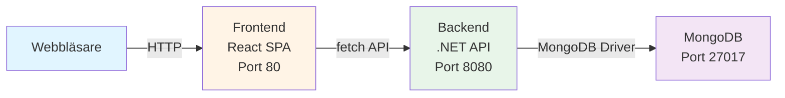
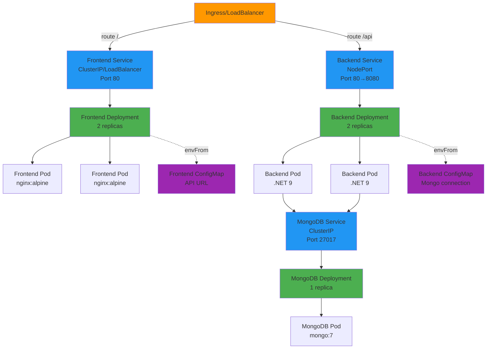
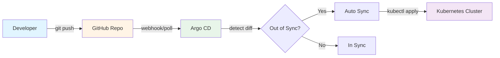

# Reverse Engineering - ToDo App Kubernetes Projekt

**Skapad:** 2025-10-02  
**Syfte:** Komplett teknisk dokumentation av projektets arkitektur, kod och deployment  
**Målgrupp:** Utvecklare som ska förstå, underhålla eller vidareutveckla systemet

---

# Översikt

## Systemsammanfattning

Detta är en fullstack ToDo-applikation bestående av:

- **Frontend:** React 18.3.1 med TypeScript 5.9.3, byggd med Vite 7.1.7
- **Backend:** .NET 9.0 Minimal API med MongoDB.Driver 3.5.0
- **Databas:** MongoDB 7
- **Containerisering:** Docker multi-stage builds
- **Orchestration:** Kubernetes med Helm 
- **GitOps:** ArgoCD för automatisk deployment
- **CI/CD:** GitHub Actions för image builds

## Versionsinfo (från källkod)

### Frontend (`app/frontend/package.json`)
```json
"dependencies": {
  "react": "^18.3.1",
  "react-dom": "^18.3.1"
},
"devDependencies": {
  "@types/react": "^18.3.12",
  "@types/react-dom": "^18.3.1",
  "@vitejs/plugin-react": "^4.3.4",
  "typescript": "~5.9.3",
  "vite": "^7.1.7"
}
```

### Backend (`app/backend/backend.csproj:4`)
```xml
<TargetFramework>net9.0</TargetFramework>
```

**NuGet Packages:**
- `Microsoft.AspNetCore.OpenApi` 9.0.4
- `MongoDB.Driver` 3.5.0

### Databas
- MongoDB 7 (från `helm/cloud-app/values.yaml:3`)

### Container Images
- Backend base: `mcr.microsoft.com/dotnet/sdk:9.0` (build), `mcr.microsoft.com/dotnet/aspnet:9.0` (runtime)
- Frontend base: `node:20-alpine` (build), `nginx:alpine` (runtime)
- MongoDB: `mongo:7`

---

# Arkitektur på hög nivå

## Dataflöde



**Kommunikation:**
- Webbläsare → Frontend: HTTP/HTTPS via Ingress/LoadBalancer
- Frontend → Backend: REST API (`/api/todos`)
- Backend → MongoDB: MongoDB Wire Protocol (TCP 27017)

## Kubernetes Arkitektur



**Service Discovery:**
- Backend hittar MongoDB via DNS: `mongodb:27017` (Service namn)
- Frontend når backend via: `http://backend` (inom cluster) eller `http://localhost:8080` (via port-forward)
- Kubernetes DNS resolver service-namn till ClusterIP automatiskt

**Portar:**
- Frontend container: 80 (nginx)
- Backend container: 8080 (.NET)
- MongoDB container: 27017
- Backend NodePort: 30080 (extern access)

---

# Källkodskarta

## Toppnivå-struktur

| Mapp/Fil | Syfte |
|----------|-------|
| `app/backend/` | .NET 9 backend API-kod |
| `app/frontend/` | React TypeScript frontend-kod |
| `k8s/` | Kubernetes manifests (manuell deployment) |
| `helm/cloud-app/` | Helm chart för paketerad deployment |
| `argocd/` | ArgoCD Application manifest för GitOps |
| `.github/workflows/` | GitHub Actions CI/CD pipeline |
| `verify.sh` | Bash-script för att verifiera deployment |
| `README.md` | Projektöversikt och instruktioner |
| `TROUBLESHOOTING.md` | Fail report med misslyckade försök |
| `SOLUTION.md` | Solution report med fungerande lösningar |

## Viktiga filer

### Backend
- `Program.cs` - Entry point, API endpoints, DI-konfiguration
- `backend.csproj` - .NET projekt-fil med dependencies
- `appsettings.json` - Konfiguration (MongoDB connection)
- `Dockerfile` - Multi-stage build för container image

### Frontend
- `src/main.tsx` - Entry point, renderar React-appen
- `src/App.tsx` - Huvudkomponent med Todo-logik
- `package.json` - NPM dependencies och scripts
- `vite.config.ts` - Vite build-konfiguration
- `tsconfig.json` - TypeScript compiler-inställningar
- `nginx.conf` - Nginx-konfiguration för SPA routing
- `Dockerfile` - Multi-stage build för container image
- `.env` - Environment variables (API URL)

### Kubernetes
- `k8s/*/deployment.yaml` - Pod-specifikationer
- `k8s/*/service.yaml` - Service definitions
- `k8s/*/configmap.yaml` - Konfigurationsdata

### Helm
- `helm/cloud-app/Chart.yaml` - Chart metadata
- `helm/cloud-app/values.yaml` - Default värden
- `helm/cloud-app/templates/*.yaml` - Kubernetes manifest-templates

---

# Frontend (React/TypeScript)

## Entry Point

**`app/frontend/src/main.tsx:1-9`**
```typescript
import { StrictMode } from 'react'
import { createRoot } from 'react-dom/client'
import App from './App.tsx'
import './App.css'

createRoot(document.getElementById('app')!).render(
  <StrictMode>
    <App />
  </StrictMode>,
)
```

**Förklaring:**
- **Rad 1-4:** Importerar React, createRoot (React 18 API), App-komponenten och CSS
- **Rad 6:** Hittar DOM-element med id `app` (från `index.html`)
- **Rad 6-9:** Skapar React root och renderar App-komponenten i StrictMode
- **StrictMode:** Aktiverar extra utvecklingsvarningar och checks

## Huvudkomponent - App.tsx

**`app/frontend/src/App.tsx:1-13`**
```typescript
import { useState, useEffect } from 'react';
import './App.css';

interface Todo {
  id: string;
  title: string;
  isCompleted: boolean;
}

function App() {
  const [todos, setTodos] = useState<Todo[]>([]);
  const [newTodo, setNewTodo] = useState('');
  const apiUrl = import.meta.env.VITE_API_URL || 'http://localhost:5000';
```

**Förklaring:**
- **Rad 4-8:** TypeScript interface för Todo-objekt (matchar backend's ToDoItem)
- **Rad 11:** State för todo-lista (array av Todo)
- **Rad 12:** State för input-fält (ny todo)
- **Rad 13:** **VIKTIGT!** API URL hämtas från Vite environment variable

### API URL - Varifrån kommer den?

**`app/frontend/.env:1`**
```bash
VITE_API_URL=http://localhost:8080
```

**Hur det fungerar:**
1. Vite läser `.env` vid **build-time** (inte runtime!)
2. `import.meta.env.VITE_API_URL` ersätts med värdet under build
3. Värdet "bakas in" i JavaScript-bundle
4. För att ändra API URL måste man rebuilda frontend

**Fallback:** Om `VITE_API_URL` saknas används `http://localhost:5000`

## API-anrop

### Hämta todos

**`app/frontend/src/App.tsx:15-20`**
```typescript
useEffect(() => {
  fetchTodos();
}, []);

const fetchTodos = async () => {
  const response = await fetch(`${apiUrl}/api/todos`);
  const data = await response.json();
  setTodos(data);
};
```

**Förklaring:**
- **Rad 15-17:** useEffect körs vid mount, anropar fetchTodos
- **Rad 19:** GET request till `/api/todos`
- **Rad 20:** Parsar JSON-response
- **Rad 21:** Uppdaterar state med todos
- **Felhantering:** Saknas! (TODO: lägg till try-catch)

### Skapa todo

**`app/frontend/src/App.tsx:22-31`**
```typescript
const addTodo = async () => {
  if (!newTodo.trim()) return;
  await fetch(`${apiUrl}/api/todos`, {
    method: 'POST',
    headers: { 'Content-Type': 'application/json' },
    body: JSON.stringify({ title: newTodo, isCompleted: false }),
  });
  setNewTodo('');
  fetchTodos();
};
```

**Förklaring:**
- **Rad 23:** Validering - skippa om tom sträng
- **Rad 24-27:** POST request med JSON body
- **Rad 28:** Rensa input-fält
- **Rad 29:** Hämta uppdaterad lista (kunde optimeras med optimistic update)

### Uppdatera todo

**`app/frontend/src/App.tsx:33-40`**
```typescript
const toggleTodo = async (todo: Todo) => {
  await fetch(`${apiUrl}/api/todos/${todo.id}`, {
    method: 'PUT',
    headers: { 'Content-Type': 'application/json' },
    body: JSON.stringify({ title: todo.title, isCompleted: !todo.isCompleted }),
  });
  fetchTodos();
};
```

**Förklaring:**
- **Rad 34:** PUT request till `/api/todos/{id}`
- **Rad 37:** Skickar hela objektet med inverterad `isCompleted`
- **Rad 39:** Hämta uppdaterad lista

### Ta bort todo

**`app/frontend/src/App.tsx:42-45`**
```typescript
const deleteTodo = async (id: string) => {
  await fetch(`${apiUrl}/api/todos/${id}`, { method: 'DELETE' });
  fetchTodos();
};
```

**Förklaring:**
- **Rad 43:** DELETE request till `/api/todos/{id}`
- **Rad 44:** Hämta uppdaterad lista

## CORS-implikationer

**Problem:** Frontend körs i webbläsare (origin: `http://localhost:3000`), backend på annan port (`http://localhost:8080`)

**Lösning:** Backend måste tillåta CORS (se Backend-sektion)

**I produktion:** Använd Ingress för att servera frontend och backend från samma origin

## Build & Scripts

**`app/frontend/package.json:6-9`**
```json
"scripts": {
  "dev": "vite",
  "build": "tsc && vite build",
  "preview": "vite preview"
}
```

**Kommandon:**
```bash
# Utveckling (hot reload)
npm run dev
# Öppnar http://localhost:5173

# Bygga för produktion
npm run build
# Output: dist/ mapp

# Förhandsgranska production build
npm run preview
```

## Vite-konfiguration

**`app/frontend/vite.config.ts:1-5`**
```typescript
import { defineConfig } from 'vite'
import react from '@vitejs/plugin-react'

export default defineConfig({
  plugins: [react()],
})
```

**Förklaring:**
- **@vitejs/plugin-react:** Hanterar JSX transformation, Fast Refresh (HMR)
- **Minimal config:** Använder Vite's defaults (port 5173, auto-detect entry point)

## TypeScript-konfiguration

**`app/frontend/tsconfig.json:8`**
```json
"jsx": "react-jsx",
```

**Viktigt:** Aktiverar nya JSX transform (React 17+), ingen `import React` behövs

---

# Backend (.NET)

## Entry Point - Program.cs

**`app/backend/Program.cs:1-5`**
```csharp
using MongoDB.Driver;
using MongoDB.Bson;
using MongoDB.Bson.Serialization.Attributes;

var builder = WebApplication.CreateBuilder(args);
```

**Förklaring:**
- **Rad 1-3:** Importerar MongoDB driver
- **Rad 5:** Skapar WebApplicationBuilder (Minimal API pattern)

## Dependency Injection & Konfiguration

**`app/backend/Program.cs:7-14`**
```csharp
builder.Services.AddOpenApi();
builder.Services.AddCors(options =>
{
    options.AddDefaultPolicy(policy =>
    {
        policy.AllowAnyOrigin().AllowAnyMethod().AllowAnyHeader();
    });
});
```

**Förklaring:**
- **Rad 7:** Registrerar OpenAPI/Swagger (endast i Development)
- **Rad 8-14:** **CORS-konfiguration** - tillåter alla origins, metoder och headers
  - **Säkerhetsvarning:** I produktion, specificera exakta origins!

### MongoDB Connection

**`app/backend/Program.cs:16-18`**
```csharp
var mongoConnectionString = builder.Configuration["Mongo:ConnectionString"] ?? "mongodb://localhost:27017";
var mongoDatabase = builder.Configuration["Mongo:Database"] ?? "ToDoAppDb";
var mongoCollection = builder.Configuration["Mongo:Collection"] ?? "ToDoItems";
```

**Förklaring:**
- **Rad 16:** Läser `Mongo:ConnectionString` från konfiguration (appsettings.json eller environment variables)
- **Fallback:** Om saknas, använd `mongodb://localhost:27017`
- **Null-coalescing operator (`??`):** Returnerar höger sida om vänster är null

**Var sätts connection string?**

1. **Lokalt:** `app/backend/appsettings.json:9`
```json
"Mongo": {
  "ConnectionString": "mongodb://localhost:27017",
  "Database": "ToDoAppDb",
  "Collection": "ToDoItems"
}
```

2. **Kubernetes:** Via ConfigMap (se Kubernetes-sektion)
```yaml
env:
  - name: Mongo__ConnectionString
    value: "mongodb://mongodb:27017"
```

**Notera:** `__` (dubbel underscore) i environment variables mappas till `:` i .NET Configuration

**`app/backend/Program.cs:20-25`**
```csharp
builder.Services.AddSingleton<IMongoClient>(new MongoClient(mongoConnectionString));
builder.Services.AddScoped(sp =>
{
    var client = sp.GetRequiredService<IMongoClient>();
    return client.GetDatabase(mongoDatabase).GetCollection<ToDoItem>(mongoCollection);
});
```

**Förklaring:**
- **Rad 20:** Registrerar MongoClient som Singleton (en instans för hela applikationen)
- **Rad 21-25:** Registrerar IMongoCollection<ToDoItem> som Scoped (en per request)
  - **Rad 23:** Hämtar MongoClient från DI
  - **Rad 24:** Returnerar collection från database

## Middleware Pipeline

**`app/backend/Program.cs:27-34`**
```csharp
var app = builder.Build();

if (app.Environment.IsDevelopment())
{
    app.MapOpenApi();
}

app.UseCors();
```

**Förklaring:**
- **Rad 27:** Bygger WebApplication
- **Rad 29-32:** Aktiverar OpenAPI endast i Development
- **Rad 34:** Aktiverar CORS middleware (måste vara före endpoints)

## API Endpoints

### GET /api/todos - Hämta alla

**`app/backend/Program.cs:36-39`**
```csharp
app.MapGet("/api/todos", async (IMongoCollection<ToDoItem> collection) =>
{
    return await collection.Find(_ => true).ToListAsync();
});
```

**Förklaring:**
- **Rad 36:** Mappar GET request till `/api/todos`
- **Parameter:** IMongoCollection injiceras automatiskt från DI
- **Rad 38:** `Find(_ => true)` = hämta alla dokument, `ToListAsync()` = asynkron lista
- **Return:** HTTP 200 med JSON array

### GET /api/todos/{id} - Hämta en

**`app/backend/Program.cs:41-45`**
```csharp
app.MapGet("/api/todos/{id}", async (string id, IMongoCollection<ToDoItem> collection) =>
{
    var item = await collection.Find(x => x.Id == id).FirstOrDefaultAsync();
    return item is not null ? Results.Ok(item) : Results.NotFound();
});
```

**Förklaring:**
- **Rad 41:** Route parameter `{id}` binds till `string id`
- **Rad 43:** Hitta dokument med matchande Id
- **Rad 44:** Returnera 200 OK om hittad, annars 404 Not Found

### POST /api/todos - Skapa ny

**`app/backend/Program.cs:47-52`**
```csharp
app.MapPost("/api/todos", async (ToDoItemDto dto, IMongoCollection<ToDoItem> collection) =>
{
    var item = new ToDoItem { Title = dto.Title, IsCompleted = false };
    await collection.InsertOneAsync(item);
    return Results.Created($"/api/todos/{item.Id}", item);
});
```

**Förklaring:**
- **Rad 47:** Body binds automatiskt till `ToDoItemDto` (JSON deserialization)
- **Rad 49:** Skapa ny ToDoItem (Id genereras automatiskt av MongoDB)
- **Rad 50:** Infoga i collection
- **Rad 51:** Returnera 201 Created med Location header och body

### PUT /api/todos/{id} - Uppdatera

**`app/backend/Program.cs:54-61`**
```csharp
app.MapPut("/api/todos/{id}", async (string id, ToDoItemDto dto, IMongoCollection<ToDoItem> collection) =>
{
    var update = Builders<ToDoItem>.Update
        .Set(x => x.Title, dto.Title)
        .Set(x => x.IsCompleted, dto.IsCompleted);
    var result = await collection.UpdateOneAsync(x => x.Id == id, update);
    return result.MatchedCount > 0 ? Results.NoContent() : Results.NotFound();
});
```

**Förklaring:**
- **Rad 56-58:** Bygger update definition med MongoDB Builders API
- **Rad 59:** Uppdatera dokument som matchar Id
- **Rad 60:** Returnera 204 No Content om uppdaterad, annars 404

### DELETE /api/todos/{id} - Ta bort

**`app/backend/Program.cs:63-67`**
```csharp
app.MapDelete("/api/todos/{id}", async (string id, IMongoCollection<ToDoItem> collection) =>
{
    var result = await collection.DeleteOneAsync(x => x.Id == id);
    return result.DeletedCount > 0 ? Results.NoContent() : Results.NotFound();
});
```

**Förklaring:**
- **Rad 65:** Ta bort dokument som matchar Id
- **Rad 66:** Returnera 204 om borttagen, annars 404

## Datamodeller

**`app/backend/Program.cs:71`**
```csharp
record ToDoItemDto(string Title, bool IsCompleted);
```

**Förklaring:**
- **Record:** Immutable data class (C# 9+)
- **Används för:** Request/Response body (DTO = Data Transfer Object)

**`app/backend/Program.cs:73-80`**
```csharp
class ToDoItem
{
    [BsonId]
    [BsonRepresentation(BsonType.ObjectId)]
    public string? Id { get; set; }
    public string Title { get; set; } = string.Empty;
    public bool IsCompleted { get; set; }
}
```

**Förklaring:**
- **[BsonId]:** Markerar som MongoDB _id field
- **[BsonRepresentation(BsonType.ObjectId)]:** Konverterar mellan string och ObjectId
- **Id:** Nullable string (genereras av MongoDB)
- **Title:** Default tom sträng (undviker null)

## Köra Lokalt

```bash
cd app/backend

# Restore dependencies
dotnet restore

# Kör i Development mode
dotnet run

# Eller med watch (auto-reload)
dotnet watch run

# API tillgänglig på: http://localhost:5000 (eller port från launchSettings.json)
```

**Testa API:**
```bash
# Hämta alla todos
curl http://localhost:5000/api/todos

# Skapa ny todo
curl -X POST http://localhost:5000/api/todos \
  -H "Content-Type: application/json" \
  -d '{"title":"Test todo","isCompleted":false}'

# Uppdatera todo (ersätt {id})
curl -X PUT http://localhost:5000/api/todos/{id} \
  -H "Content-Type: application/json" \
  -d '{"title":"Updated","isCompleted":true}'

# Ta bort todo
curl -X DELETE http://localhost:5000/api/todos/{id}
```

## Health Checks & Logging

**Health Checks:** Saknas i repo (TODO: lägg till `/health` endpoint)

**Logging:** Använder ASP.NET Core's inbyggda logging
- **Konfiguration:** `appsettings.json:2-7`
- **Log Level:** Information för Default, Warning för Microsoft.AspNetCore

---

# Docker

## Backend Dockerfile

**`app/backend/Dockerfile:1-6` (Build Stage)**
```dockerfile
FROM mcr.microsoft.com/dotnet/sdk:9.0 AS build
WORKDIR /src
COPY backend.csproj .
RUN dotnet restore
COPY . .
RUN dotnet publish -c Release -o /app
```

**Förklaring:**
- **Rad 1:** Base image med .NET SDK 9.0 (innehåller compiler)
- **Rad 2:** Sätt working directory till /src
- **Rad 3:** Kopiera endast .csproj först (för layer caching)
- **Rad 4:** Restore NuGet packages (cacheas om .csproj inte ändrats)
- **Rad 5:** Kopiera resten av källkoden
- **Rad 6:** Kompilera och publicera till /app (Release mode, optimerad)

**`app/backend/Dockerfile:8-13` (Runtime Stage)**
```dockerfile
FROM mcr.microsoft.com/dotnet/aspnet:9.0
WORKDIR /app
COPY --from=build /app .
EXPOSE 8080
ENV ASPNETCORE_URLS=http://+:8080
ENTRYPOINT ["dotnet", "backend.dll"]
```

**Förklaring:**
- **Rad 8:** Base image med endast ASP.NET runtime (mindre än SDK)
- **Rad 10:** Kopiera compiled app från build stage
- **Rad 11:** Dokumenterar att port 8080 används
- **Rad 12:** Sätt ASP.NET att lyssna på port 8080 (alla interfaces)
- **Rad 13:** Starta applikationen

**Varför multi-stage?**
- **Build stage:** ~1.5 GB (SDK + dependencies)
- **Runtime stage:** ~260 MB (endast runtime + app)
- **Resultat:** Mindre image, snabbare deployment, säkrare (ingen compiler i production)

## Frontend Dockerfile

**`app/frontend/Dockerfile:1-6` (Build Stage)**
```dockerfile
FROM node:20-alpine AS build
WORKDIR /app
COPY package*.json ./
RUN npm install
COPY . .
RUN npm run build
```

**Förklaring:**
- **Rad 1:** Node 20 Alpine (minimal Linux distribution)
- **Rad 3:** Kopiera package.json och package-lock.json
- **Rad 4:** Installera dependencies (cacheas om package.json inte ändrats)
- **Rad 5:** Kopiera källkod
- **Rad 6:** Bygga production bundle (TypeScript → JavaScript, minifiering)

**`app/frontend/Dockerfile:8-12` (Runtime Stage)**
```dockerfile
FROM nginx:alpine
COPY --from=build /app/dist /usr/share/nginx/html
COPY nginx.conf /etc/nginx/conf.d/default.conf
EXPOSE 80
CMD ["nginx", "-g", "daemon off;"]
```

**Förklaring:**
- **Rad 8:** Nginx Alpine (liten webbserver)
- **Rad 9:** Kopiera byggda filer från build stage till nginx html-mapp
- **Rad 10:** Kopiera custom nginx-konfiguration
- **Rad 11:** Dokumenterar port 80
- **Rad 12:** Starta nginx i foreground mode (för Docker)

**Nginx-konfiguration (`app/frontend/nginx.conf:1-10`)**
```nginx
server {
    listen 80;
    server_name localhost;
    root /usr/share/nginx/html;
    index index.html;

    location / {
        try_files $uri $uri/ /index.html;
    }
}
```

**Förklaring:**
- **Rad 8:** **Viktigt!** SPA routing - alla requests som inte matchar fil serveras index.html
  - Exempel: `/todos/123` → index.html (React Router hanterar routing)

## .dockerignore

**`app/backend/.dockerignore` (saknas i repo, bör finnas)**
```
bin/
obj/
*.user
```

**`app/frontend/.dockerignore` (saknas i repo, bör finnas)**
```
node_modules/
dist/
.env.local
```

**Varför viktigt?**
- Undviker att kopiera onödiga filer till build context
- Snabbare builds
- Mindre image size

## Environment Variables i Docker

**Backend:**
- `ASPNETCORE_URLS`: Sätts i Dockerfile
- `Mongo__ConnectionString`: Sätts av Kubernetes (ConfigMap)

**Frontend:**
- `VITE_API_URL`: Läses från `.env` vid **build-time**
- Måste rebuilda för att ändra

---


# Kubernetes (k8s/)

## Backend Deployment

**`k8s/backend/deployment.yaml:1-35`**
```yaml
apiVersion: apps/v1
kind: Deployment
metadata:
  name: backend
  labels:
    app: backend
spec:
  replicas: 2
  selector:
    matchLabels:
      app: backend
  template:
    metadata:
      labels:
        app: backend
    spec:
      containers:
      - name: backend
        image: your-registry/todo-backend:latest
        ports:
        - containerPort: 8080
        envFrom:
        - configMapRef:
            name: backend-config
        livenessProbe:
          httpGet:
            path: /api/todos
            port: 8080
          initialDelaySeconds: 30
          periodSeconds: 10
        readinessProbe:
          httpGet:
            path: /api/todos
            port: 8080
          initialDelaySeconds: 5
          periodSeconds: 5
```

**Förklaring:**
- **Rad 8:** 2 replicas för high availability
- **Rad 10-11:** Selector matchar pods med label `app: backend`
- **Rad 19:** **OBS!** Placeholder image-namn (måste ändras)
- **Rad 21:** Container lyssnar på port 8080
- **Rad 22-24:** Laddar alla env vars från ConfigMap `backend-config`
- **Rad 25-30:** **Liveness Probe** - Kubernetes startar om pod om den inte svarar
  - Väntar 30s efter start, kollar var 10:e sekund
- **Rad 31-36:** **Readiness Probe** - Pod får inte trafik förrän den svarar
  - Väntar 5s efter start, kollar var 5:e sekund

## Backend Service

**`k8s/backend/service.yaml:1-13`**
```yaml
apiVersion: v1
kind: Service
metadata:
  name: backend
  labels:
    app: backend
spec:
  type: ClusterIP
  ports:
  - port: 80
    targetPort: 8080
  selector:
    app: backend
```

**Förklaring:**
- **Rad 4:** Service namn `backend` (används för DNS: `backend.default.svc.cluster.local`)
- **Rad 8:** ClusterIP = endast tillgänglig inom cluster
- **Rad 10:** Service lyssnar på port 80
- **Rad 11:** Vidarebefordrar till container port 8080
- **Rad 12-13:** Selector matchar pods med label `app: backend`

## Backend ConfigMap

**`k8s/backend/configmap.yaml:1-11`**
```yaml
apiVersion: v1
kind: ConfigMap
metadata:
  name: backend-config
  labels:
    app: backend
data:
  Mongo__ConnectionString: "mongodb://mongodb:27017"
  Mongo__Database: "ToDoAppDb"
  Mongo__Collection: "ToDoItems"
```

**Förklaring:**
- **Rad 8:** Connection string använder service-namn `mongodb`
- **Rad 9-10:** Database och collection namn
- **Viktigt:** `__` (dubbel underscore) mappas till `:` i .NET Configuration

## MongoDB Deployment

**`k8s/mongodb/deployment.yaml:1-29`**
```yaml
apiVersion: apps/v1
kind: Deployment
metadata:
  name: mongodb
  labels:
    app: mongodb
spec:
  replicas: 1
  selector:
    matchLabels:
      app: mongodb
  template:
    metadata:
      labels:
        app: mongodb
    spec:
      containers:
      - name: mongodb
        image: mongo:7
        ports:
        - containerPort: 27017
        env:
        - name: MONGO_INITDB_DATABASE
          value: ToDoAppDb
        volumeMounts:
        - name: mongodb-data
          mountPath: /data/db
      volumes:
      - name: mongodb-data
        emptyDir: {}
```

**Förklaring:**
- **Rad 8:** 1 replica (stateful, bör använda StatefulSet i produktion)
- **Rad 19:** Officiell MongoDB 7 image
- **Rad 23-24:** Skapar initial database
- **Rad 25-27:** Monterar volume för data persistence
- **Rad 28-30:** **emptyDir** = temporär storage, data försvinner vid pod restart
  - **TODO:** Använd PersistentVolumeClaim för permanent storage

## MongoDB Service

**`k8s/mongodb/service.yaml:1-13`**
```yaml
apiVersion: v1
kind: Service
metadata:
  name: mongodb
  labels:
    app: mongodb
spec:
  type: ClusterIP
  ports:
  - port: 27017
    targetPort: 27017
  selector:
    app: mongodb
```

**Förklaring:**
- **Rad 4:** Service namn `mongodb` (backend använder detta i connection string)
- **Rad 10-11:** Port 27017 (MongoDB default)

## Frontend Deployment & Service

**Frontend deployment och service följer samma mönster som backend**

**Viktiga skillnader:**
- Container port: 80 (nginx)
- Service type: LoadBalancer (för extern access)
- Ingen liveness/readiness probe i k8s/ (finns i Helm)

## Namespace

**Saknas i repo** - Alla resurser deployar till `default` namespace

**Best practice:** Skapa dedikerad namespace
```yaml
apiVersion: v1
kind: Namespace
metadata:
  name: todo-app
```

---

# Helm (helm/)

## Vad är Helm?

Helm är en "package manager" för Kubernetes:
- **Chart:** Paket med Kubernetes manifests (templates)
- **Values:** Konfigurationsvärden som injiceras i templates
- **Release:** Installerad instans av ett chart

**Fördelar:**
- Templating (återanvändning)
- Versionshantering
- Enkel upgrade/rollback
- Paketerad deployment

## Chart.yaml

**`helm/cloud-app/Chart.yaml:1-6`**
```yaml
apiVersion: v2
name: cloud-app
description: A Helm chart for ToDo application with MongoDB
type: application
version: 0.1.0
appVersion: "1.0"
```

**Förklaring:**
- **version:** Chart version (ändras vid chart-uppdateringar)
- **appVersion:** Applikationens version (dokumentation)

## Values.yaml

**`helm/cloud-app/values.yaml:1-28`**
```yaml
mongodb:
  enabled: true
  image: mongo:7
  replicas: 1
  database: ToDoAppDb
  service:
    port: 27017

backend:
  enabled: true
  image: todo-backend:latest
  replicas: 2
  service:
    port: 80
    targetPort: 8080
  config:
    mongoConnectionString: "mongodb://mongodb:27017"
    mongoDatabase: "ToDoAppDb"
    mongoCollection: "ToDoItems"

frontend:
  enabled: true
  image: todo-frontend:v5
  replicas: 2
  service:
    type: LoadBalancer
    port: 80
  config:
    apiUrl: "http://backend"
```

**Förklaring:**
- **enabled:** Möjliggör att slå av/på komponenter
- **image:** Container image (kan overridas vid install)
- **replicas:** Antal pods
- **config:** Applikationsspecifik konfiguration

## Template - Backend Deployment

**`helm/cloud-app/templates/backend-deployment.yaml:1-29`**
```yaml
{{- if .Values.backend.enabled }}
apiVersion: apps/v1
kind: Deployment
metadata:
  name: {{ .Release.Name }}-backend
  labels:
    app: backend
    release: {{ .Release.Name }}
spec:
  replicas: {{ .Values.backend.replicas }}
  selector:
    matchLabels:
      app: backend
      release: {{ .Release.Name }}
  template:
    metadata:
      labels:
        app: backend
        release: {{ .Release.Name }}
    spec:
      containers:
      - name: backend
        image: {{ .Values.backend.image }}
        imagePullPolicy: IfNotPresent
        ports:
        - containerPort: {{ .Values.backend.service.targetPort }}
        envFrom:
        - configMapRef:
            name: {{ .Release.Name }}-backend-config
{{- end }}
```

**Förklaring:**
- **Rad 1:** Conditional - endast skapa om `backend.enabled: true`
- **Rad 5:** Release name prefix (ex: `todo-app-backend`)
- **Rad 8:** Extra label för att identifiera release
- **Rad 10:** Replicas från values
- **Rad 23:** Image från values
- **Rad 24:** **IfNotPresent** - använd lokal image om finns (viktigt för Minikube)
- **Rad 29:** ConfigMap namn med release prefix

## Template - Backend ConfigMap

**`helm/cloud-app/templates/backend-configmap.yaml:1-13`**
```yaml
{{- if .Values.backend.enabled }}
apiVersion: v1
kind: ConfigMap
metadata:
  name: {{ .Release.Name }}-backend-config
  labels:
    app: backend
    release: {{ .Release.Name }}
data:
  Mongo__ConnectionString: {{ .Values.backend.config.mongoConnectionString | quote }}
  Mongo__Database: {{ .Values.backend.config.mongoDatabase | quote }}
  Mongo__Collection: {{ .Values.backend.config.mongoCollection | quote }}
{{- end }}
```

**Förklaring:**
- **Rad 10-12:** Values injiceras med `{{ .Values.path.to.value }}`
- **| quote:** Pipe till quote-funktion (säkerställer korrekt YAML-formatering)

## Template - Backend Service

**`helm/cloud-app/templates/backend-service.yaml:1-17`**
```yaml
{{- if .Values.backend.enabled }}
apiVersion: v1
kind: Service
metadata:
  name: backend
  labels:
    app: backend
    release: {{ .Release.Name }}
spec:
  type: NodePort
  ports:
  - port: {{ .Values.backend.service.port }}
    targetPort: {{ .Values.backend.service.targetPort }}
    nodePort: 30080
  selector:
    app: backend
    release: {{ .Release.Name }}
{{- end }}
```

**Förklaring:**
- **Rad 5:** Service namn `backend` (utan release prefix för enklare DNS)
- **Rad 10:** NodePort för extern access (alternativ till LoadBalancer)
- **Rad 14:** Hårdkodad nodePort 30080 (bör vara konfigurerbar)

## Helm Kommandon

### Installera

```bash
# Installera chart
helm install todo-app helm/cloud-app

# Installera med custom values
helm install todo-app helm/cloud-app \
  --set backend.image=todo-backend:v2 \
  --set frontend.image=todo-frontend:v3

# Installera i specifik namespace
helm install todo-app helm/cloud-app --namespace todo-app --create-namespace

# Dry-run (visa vad som skulle skapas)
helm install todo-app helm/cloud-app --dry-run --debug
```

### Uppgradera

```bash
# Uppgradera release
helm upgrade todo-app helm/cloud-app

# Uppgradera med nya values
helm upgrade todo-app helm/cloud-app \
  --set backend.replicas=3

# Upgrade eller install om inte finns
helm upgrade --install todo-app helm/cloud-app
```

### Hantera

```bash
# Lista releases
helm list

# Visa status
helm status todo-app

# Visa values
helm get values todo-app

# Visa manifest
helm get manifest todo-app

# Rollback till föregående version
helm rollback todo-app

# Rollback till specifik revision
helm rollback todo-app 2

# Avinstallera
helm uninstall todo-app
```

### Testa Template

```bash
# Rendera templates lokalt
helm template todo-app helm/cloud-app

# Rendera med custom values
helm template todo-app helm/cloud-app \
  --set backend.image=test:latest

# Validera
helm lint helm/cloud-app
```

---

# Argo CD (argocd/)

## Vad är Argo CD?

Argo CD är en **GitOps** continuous delivery tool för Kubernetes:

**GitOps Principer:**
1. Git är "source of truth" för desired state
2. Argo CD synkar cluster state med Git
3. Ändringar görs via Git commits (inte kubectl)
4. Automatisk drift detection och sync

**Fördelar:**
- Deklarativ deployment
- Audit trail (Git history)
- Enkel rollback (Git revert)
- Multi-cluster support

## Application Manifest

**`argocd/app.yaml:1-22`**
```yaml
apiVersion: argoproj.io/v1alpha1
kind: Application
metadata:
  name: todo-app
  namespace: argocd
spec:
  project: default
  source:
    repoURL: https://github.com/YOUR-USERNAME/projektAppdemo.git
    targetRevision: HEAD
    path: helm/cloud-app
    helm:
      valueFiles:
        - values.yaml
  destination:
    server: https://kubernetes.default.svc
    namespace: default
  syncPolicy:
    automated:
      prune: true
      selfHeal: true
    syncOptions:
      - CreateNamespace=true
```

**Förklaring:**

### Metadata
- **Rad 4:** Application namn i Argo CD
- **Rad 5:** Argo CD installeras i `argocd` namespace

### Source
- **Rad 9:** **OBS!** Placeholder - måste ändras till faktisk Git repo
- **Rad 10:** `HEAD` = följ main/master branch
- **Rad 11:** Path till Helm chart i repo
- **Rad 12-14:** Använd Helm med values.yaml

### Destination
- **Rad 16:** `https://kubernetes.default.svc` = samma cluster som Argo CD
- **Rad 17:** Deploy till `default` namespace

### Sync Policy
- **Rad 19:** `automated` = auto-sync vid Git changes
- **Rad 20:** `prune: true` = ta bort resurser som inte finns i Git
- **Rad 21:** `selfHeal: true` = återställ om någon ändrar manuellt med kubectl
- **Rad 23:** Skapa namespace automatiskt om saknas

## Installera Argo CD

```bash
# Skapa namespace
kubectl create namespace argocd

# Installera Argo CD
kubectl apply -n argocd -f https://raw.githubusercontent.com/argoproj/argo-cd/stable/manifests/install.yaml

# Vänta på att pods startar
kubectl wait --for=condition=Ready pods --all -n argocd --timeout=300s

# Hämta admin lösenord
kubectl -n argocd get secret argocd-initial-admin-secret \
  -o jsonpath="{.data.password}" | base64 -d

# Port-forward till UI
kubectl port-forward svc/argocd-server -n argocd 8080:443

# Öppna UI: https://localhost:8080
# Username: admin
# Password: (från kommandot ovan)
```

## Skapa Application

```bash
# Applicera Application manifest
kubectl apply -f argocd/app.yaml

# Eller via CLI
argocd app create todo-app \
  --repo https://github.com/YOUR-USERNAME/projektAppdemo.git \
  --path helm/cloud-app \
  --dest-server https://kubernetes.default.svc \
  --dest-namespace default \
  --sync-policy automated \
  --auto-prune \
  --self-heal
```

## Hantera Application

```bash
# Lista applications
argocd app list

# Visa status
argocd app get todo-app

# Manuell sync
argocd app sync todo-app

# Rollback
argocd app rollback todo-app

# Ta bort application (behåller resurser)
argocd app delete todo-app

# Ta bort application och resurser
argocd app delete todo-app --cascade
```

## GitOps Workflow



**Steg:**
1. Developer ändrar `helm/cloud-app/values.yaml` (ex: ny image version)
2. Commit och push till Git
3. Argo CD detekterar ändring (webhook eller polling)
4. Argo CD jämför Git state med cluster state
5. Om olika: Argo CD synkar automatiskt (om `automated: true`)
6. Kubernetes uppdateras med nya resurser

## Rollback med Argo CD

```bash
# Visa history
argocd app history todo-app

# Rollback till föregående version
argocd app rollback todo-app

# Rollback till specifik revision
argocd app rollback todo-app 5
```

**Eller via Git:**
```bash
# Revert commit
git revert HEAD

# Push
git push

# Argo CD synkar automatiskt till föregående state
```

---

# CI/CD (.github/workflows/ci.yaml)

## Pipeline Översikt

**Triggers:**
- Push till `main` branch
- Pull requests mot `main`

**Jobs:**
1. `build-backend` - Bygger och pushar backend image
2. `build-frontend` - Bygger och pushar frontend image

**Parallellisering:** Båda jobs körs samtidigt (ingen dependency)

## Environment Variables

**`.github/workflows/ci.yaml:7-10`**
```yaml
env:
  REGISTRY: ghcr.io
  BACKEND_IMAGE: ${{ github.repository }}/todo-backend
  FRONTEND_IMAGE: ${{ github.repository }}/todo-frontend
```

**Förklaring:**
- **REGISTRY:** GitHub Container Registry
- **github.repository:** Automatisk variabel (ex: `username/projektAppdemo`)
- **Resultat:** `ghcr.io/username/projektAppdemo/todo-backend`

## Build Backend Job

**`.github/workflows/ci.yaml:12-35`**
```yaml
build-backend:
  runs-on: ubuntu-latest
  permissions:
    contents: read
    packages: write
  steps:
    - uses: actions/checkout@v4
    
    - name: Log in to Container Registry
      uses: docker/login-action@v3
      with:
        registry: ${{ env.REGISTRY }}
        username: ${{ github.actor }}
        password: ${{ secrets.GITHUB_TOKEN }}
    
    - name: Build and push backend
      uses: docker/build-push-action@v5
      with:
        context: ./app/backend
        push: ${{ github.event_name != 'pull_request' }}
        tags: ${{ env.REGISTRY }}/${{ env.BACKEND_IMAGE }}:${{ github.sha }},${{ env.REGISTRY }}/${{ env.BACKEND_IMAGE }}:latest
```

**Förklaring:**

### Permissions
- **Rad 14-15:** Behörigheter för att läsa repo och skriva till packages

### Steps

**1. Checkout (Rad 17)**
- Klonar repo till runner

**2. Login (Rad 19-24)**
- Loggar in till GitHub Container Registry
- **username:** `github.actor` = användare som triggade workflow
- **password:** `GITHUB_TOKEN` = automatisk secret (ingen setup behövs)

**3. Build and Push (Rad 26-31)**
- **context:** Build context (mapp med Dockerfile)
- **push:** Endast push vid push till main (inte PR)
- **tags:** Två tags:
  - `{sha}` = Git commit hash (ex: `abc123`)
  - `latest` = senaste versionen

## Build Frontend Job

**Identisk struktur som backend**, endast skillnad:
- **context:** `./app/frontend`
- **tags:** `todo-frontend:...`

## Secrets

**Används:**
- `GITHUB_TOKEN` - Automatisk, ingen konfiguration behövs

**Saknas:**
- Kubernetes deployment step (måste läggas till manuellt eller via Argo CD)
- Test steps (unit tests, integration tests)
- Linting/code quality checks

## Förbättringar (TODO)

```yaml
# Lägg till test step
- name: Run tests
  run: |
    cd app/backend
    dotnet test

# Lägg till Argo CD sync
- name: Trigger Argo CD sync
  run: |
    argocd app sync todo-app --auth-token ${{ secrets.ARGOCD_TOKEN }}

# Lägg till caching
- name: Cache NuGet packages
  uses: actions/cache@v3
  with:
    path: ~/.nuget/packages
    key: ${{ runner.os }}-nuget-${{ hashFiles('**/*.csproj') }}
```

---

# Lokal utveckling & körning

## Förutsättningar

```bash
# Installera verktyg
brew install node          # Node.js 20+
brew install dotnet        # .NET 9 SDK
brew install docker        # Docker Desktop
brew install kubectl       # Kubernetes CLI
brew install helm          # Helm
brew install minikube      # Lokal Kubernetes

# Starta Minikube
minikube start
```

## Steg 1: Starta MongoDB

```bash
# Med Docker
docker run -d \
  --name mongodb \
  -p 27017:27017 \
  mongo:7

# Eller med Kubernetes
kubectl apply -f k8s/mongodb/
```

## Steg 2: Starta Backend

```bash
cd app/backend

# Restore dependencies
dotnet restore

# Kör applikationen
dotnet run

# Backend körs på: http://localhost:5000
```

**Testa:**
```bash
# Hämta todos
curl http://localhost:5000/api/todos

# Skapa todo
curl -X POST http://localhost:5000/api/todos \
  -H "Content-Type: application/json" \
  -d '{"title":"Test från curl","isCompleted":false}'
```

## Steg 3: Starta Frontend

```bash
cd app/frontend

# Installera dependencies
npm install

# Uppdatera .env
echo "VITE_API_URL=http://localhost:5000" > .env

# Kör dev server
npm run dev

# Frontend körs på: http://localhost:5173
```

**Öppna i webbläsare:** http://localhost:5173

## Kubernetes Deployment (Lokal)

### Med kubectl

```bash
# Deploy alla komponenter
kubectl apply -f k8s/mongodb/
kubectl apply -f k8s/backend/
kubectl apply -f k8s/frontend/

# Kolla status
kubectl get pods
kubectl get services

# Port-forward för access
kubectl port-forward svc/backend 8080:80 &
kubectl port-forward svc/frontend 3000:80 &

# Öppna: http://localhost:3000
```

### Med Helm

```bash
# Bygg Docker images
docker build -t todo-backend:latest ./app/backend
docker build -t todo-frontend:v5 ./app/frontend

# Ladda till Minikube
minikube image load todo-backend:latest
minikube image load todo-frontend:v5

# Installera med Helm
helm install todo-app helm/cloud-app

# Kolla status
helm status todo-app
kubectl get pods

# Port-forward
kubectl port-forward svc/backend 8080:80 &
kubectl port-forward svc/frontend 3000:80 &
```

### Verifiera Deployment

```bash
# Kör verifieringsskript
./verify.sh

# Eller manuellt
kubectl get pods
kubectl logs -f deployment/todo-app-backend
kubectl logs -f deployment/todo-app-frontend
```

## CRUD Exempel med curl

```bash
# Hämta alla todos
curl http://localhost:8080/api/todos

# Skapa ny todo
curl -X POST http://localhost:8080/api/todos \
  -H "Content-Type: application/json" \
  -d '{"title":"Köp mjölk","isCompleted":false}'

# Uppdatera todo (ersätt {id} med faktiskt ID)
curl -X PUT http://localhost:8080/api/todos/{id} \
  -H "Content-Type: application/json" \
  -d '{"title":"Köp mjölk","isCompleted":true}'

# Ta bort todo
curl -X DELETE http://localhost:8080/api/todos/{id}

# Hämta specifik todo
curl http://localhost:8080/api/todos/{id}
```

## Postman Collection

**(Saknas i repo - TODO: skapa)**

```json
{
  "info": {
    "name": "ToDo API",
    "schema": "https://schema.getpostman.com/json/collection/v2.1.0/collection.json"
  },
  "item": [
    {
      "name": "Get All Todos",
      "request": {
        "method": "GET",
        "url": "{{baseUrl}}/api/todos"
      }
    },
    {
      "name": "Create Todo",
      "request": {
        "method": "POST",
        "url": "{{baseUrl}}/api/todos",
        "body": {
          "mode": "raw",
          "raw": "{\"title\":\"New todo\",\"isCompleted\":false}"
        }
      }
    }
  ],
  "variable": [
    {
      "key": "baseUrl",
      "value": "http://localhost:8080"
    }
  ]
}
```

---

# Vanliga fel & felsökning

## ERR_CONNECTION_REFUSED / ERR_CONNECTION_TIMED_OUT

**Symptom:**
```
Webbläsare: localhost avvisade anslutningen
ERR_CONNECTION_REFUSED
```

**Checklista:**

### 1. Kontrollera att port-forward körs
```bash
# Kolla om port-forward processer finns
ps aux | grep "port-forward"

# Om inte, starta dem
kubectl port-forward svc/backend 8080:80 &
kubectl port-forward svc/frontend 3000:80 &
```

### 2. Verifiera att pods körs
```bash
kubectl get pods

# Alla ska vara Running
# Om CrashLoopBackOff eller Error, kolla logs:
kubectl logs -f <pod-name>
```

### 3. Kontrollera services
```bash
kubectl get svc

# Verifiera att services finns och har rätt ports
```

### 4. Testa från pod
```bash
# Exec in i en pod och testa intern kommunikation
kubectl exec -it <frontend-pod> -- sh
wget -O- http://backend/api/todos
```

### 5. Kontrollera API URL i frontend
```bash
# Kolla vilken URL frontend använder
kubectl exec <frontend-pod> -- cat /usr/share/nginx/html/assets/*.js | grep -o "http://[^\"]*"
```

## CORS Error

**Symptom:**
```
Access to fetch at 'http://localhost:8080/api/todos' from origin 
'http://localhost:3000' has been blocked by CORS policy
```

**Orsak:** Backend tillåter inte requests från frontend's origin

**Lösning:**

### 1. Verifiera CORS-konfiguration i backend
```csharp
// app/backend/Program.cs:8-14
builder.Services.AddCors(options =>
{
    options.AddDefaultPolicy(policy =>
    {
        policy.AllowAnyOrigin().AllowAnyMethod().AllowAnyHeader();
    });
});
```

### 2. Kontrollera att UseCors() anropas
```csharp
// app/backend/Program.cs:34
app.UseCors();
```

### 3. Testa med curl (bör fungera)
```bash
curl -H "Origin: http://localhost:3000" \
     -H "Access-Control-Request-Method: GET" \
     -X OPTIONS \
     http://localhost:8080/api/todos -v
```

### 4. Production fix: Använd Ingress
```yaml
# Servera frontend och backend från samma origin
apiVersion: networking.k8s.io/v1
kind: Ingress
metadata:
  name: todo-app
spec:
  rules:
  - host: todo.local
    http:
      paths:
      - path: /api
        backend:
          service:
            name: backend
      - path: /
        backend:
          service:
            name: frontend
```

## ImagePullBackOff

**Symptom:**
```bash
$ kubectl get pods
NAME                       READY   STATUS             RESTARTS   AGE
backend-xxx                0/1     ImagePullBackOff   0          2m
```

**Orsaker & Lösningar:**

### 1. Image finns inte i registry
```bash
# Kolla events
kubectl describe pod <pod-name>

# Om "pull access denied" eller "not found":
# Bygg och ladda image till Minikube
docker build -t todo-backend:latest ./app/backend
minikube image load todo-backend:latest
```

### 2. Fel image-namn i manifest
```bash
# Kolla image-namn
kubectl get deployment <name> -o jsonpath='{.spec.template.spec.containers[0].image}'

# Uppdatera om fel
kubectl set image deployment/<name> <container>=<correct-image>
```

### 3. imagePullPolicy fel
```yaml
# För lokala images, använd:
imagePullPolicy: IfNotPresent

# INTE:
imagePullPolicy: Always  # Försöker hämta från registry
```

## CrashLoopBackOff

**Symptom:**
```bash
$ kubectl get pods
NAME                       READY   STATUS              RESTARTS   AGE
backend-xxx                0/1     CrashLoopBackOff    5          5m
```

**Felsökning:**

### 1. Kolla logs
```bash
kubectl logs <pod-name>

# Om pod har restartat, kolla föregående logs
kubectl logs <pod-name> --previous
```

### 2. Vanliga orsaker

**MongoDB connection error:**
```
Unable to connect to MongoDB: No connection could be made
```
**Lösning:** Kontrollera att MongoDB pod körs och connection string är korrekt

**Port redan används:**
```
Address already in use
```
**Lösning:** Ändra port i Dockerfile eller deployment

**Missing environment variables:**
```
Configuration 'Mongo:ConnectionString' not found
```
**Lösning:** Kontrollera ConfigMap och envFrom

### 3. Describe pod
```bash
kubectl describe pod <pod-name>

# Kolla Events-sektionen för felmeddelanden
```

## ArgoCD OutOfSync

**Symptom:**
```
Application: todo-app
Status: OutOfSync
```

**Orsaker:**

### 1. Manuella ändringar med kubectl
```bash
# Någon har kört kubectl apply/edit direkt
# Lösning: Låt Argo CD synka om (selfHeal gör detta automatiskt)
argocd app sync todo-app
```

### 2. Git repo inte uppdaterad
```bash
# Kolla vad som är olika
argocd app diff todo-app

# Uppdatera Git repo med aktuell state
# Eller synka från Git
argocd app sync todo-app
```

### 3. Helm values ändrade lokalt
```bash
# Om values.yaml ändrats men inte committats
git status
git add helm/cloud-app/values.yaml
git commit -m "Update values"
git push
```

## MongoDB Connection Failed

**Symptom:**
```
Backend logs: MongoConnectionException: No connection could be made
```

**Felsökning:**

### 1. Kontrollera MongoDB pod
```bash
kubectl get pods -l app=mongodb

# Om inte Running:
kubectl logs <mongodb-pod>
kubectl describe pod <mongodb-pod>
```

### 2. Testa connection från backend pod
```bash
kubectl exec -it <backend-pod> -- sh

# Installera mongo client (om saknas)
apk add mongodb-tools

# Testa connection
mongosh mongodb://mongodb:27017/ToDoAppDb
```

### 3. Verifiera connection string
```bash
# Kolla ConfigMap
kubectl get configmap backend-config -o yaml

# Ska vara: mongodb://mongodb:27017
# INTE: mongodb://localhost:27017
```

### 4. Kontrollera service
```bash
kubectl get svc mongodb

# Ska ha ClusterIP och port 27017
```

## Frontend visar fel innehåll

**Symptom:** Frontend visar Vite's default startsida istället för ToDo-appen

**Orsak:** Gammal image används (cache problem)

**Lösning:**

### 1. Använd versionstaggade images
```bash
# Bygg med ny version
docker build -t todo-frontend:v6 ./app/frontend

# Ladda till Minikube
minikube image load todo-frontend:v6

# Uppdatera values.yaml
# frontend.image: todo-frontend:v6

# Upgrade Helm
helm upgrade todo-app helm/cloud-app
```

### 2. Verifiera image i pod
```bash
# Kolla vilken image som används
kubectl get pod <frontend-pod> -o jsonpath='{.spec.containers[0].image}'

# Kolla innehåll i pod
kubectl exec <frontend-pod> -- cat /usr/share/nginx/html/index.html
```

### 3. Force pull
```bash
# Radera pods för att tvinga ny image
kubectl delete pods -l app=frontend
```

## Health Check Failures

**Symptom:**
```
Liveness probe failed: HTTP probe failed with statuscode: 500
Readiness probe failed: Get http://10.244.0.5:8080/api/todos: dial tcp 10.244.0.5:8080: connect: connection refused
```

**Lösningar:**

### 1. Öka initialDelaySeconds
```yaml
livenessProbe:
  httpGet:
    path: /api/todos
    port: 8080
  initialDelaySeconds: 60  # Öka från 30
  periodSeconds: 10
```

### 2. Lägg till health endpoint
```csharp
// app/backend/Program.cs
app.MapGet("/health", () => Results.Ok(new { status = "healthy" }));
```

```yaml
livenessProbe:
  httpGet:
    path: /health  # Använd dedikerad endpoint
    port: 8080
```

### 3. Kontrollera att port är korrekt
```bash
# Kolla vilken port container lyssnar på
kubectl exec <pod> -- netstat -tlnp
```

---

# Ordförklaringar

## Helm

**Helm:** Package manager för Kubernetes, som apt/yum för Linux

**Chart:** Paket med Kubernetes manifests (templates + values)
- Exempel: `helm/cloud-app/` är ett chart

**Values:** Konfigurationsfil med värden som injiceras i templates
- Exempel: `values.yaml` innehåller image-namn, replicas, etc.

**Template:** Kubernetes manifest med placeholders
- Exempel: `{{ .Values.backend.image }}` ersätts med värde från values.yaml

**Release:** Installerad instans av ett chart
- Exempel: `helm install todo-app` skapar release med namn "todo-app"

**Repository:** Samling av charts (som NPM registry)
- Exempel: `helm repo add bitnami https://charts.bitnami.com/bitnami`

## Argo CD

**Argo CD:** GitOps continuous delivery tool för Kubernetes

**Application:** Argo CD-resurs som representerar en app att deploya
- Definierar: Git repo, path, destination cluster

**Project:** Gruppering av applications med gemensamma policies
- Default project används om inget annat anges

**Sync:** Process att applicera Git state till Kubernetes cluster
- Manual sync: Triggas av användare
- Auto sync: Triggas automatiskt vid Git changes

**syncPolicy:** Konfiguration för hur sync ska ske
- `automated`: Auto-sync vid Git changes
- `prune`: Ta bort resurser som inte finns i Git
- `selfHeal`: Återställ om någon ändrar manuellt

**OutOfSync:** State när Git och cluster är olika
- Orsak: Manuella ändringar eller Git inte uppdaterad

**Prune:** Ta bort Kubernetes-resurser som inte finns i Git
- Exempel: Om du tar bort en Deployment från Git, tas den bort från cluster

**SelfHeal:** Automatiskt återställa cluster state till Git state
- Exempel: Om någon kör `kubectl scale`, återställs till Git-värde

## Kubernetes

**Ingress:** Kubernetes-resurs för HTTP/HTTPS routing
- Exponerar services externt med URL-baserad routing
- Exempel: `/api` → backend, `/` → frontend

**Service:** Abstraction för att nå pods
- Typer:
  - **ClusterIP:** Endast inom cluster (default)
  - **NodePort:** Exponerar på node's IP:port
  - **LoadBalancer:** Skapar extern load balancer

**Deployment:** Deklarativ definition av pods och replicas
- Hanterar rolling updates, rollbacks, scaling

**Pod:** Minsta deployable unit, innehåller en eller flera containers
- Ephemeral (tillfällig), kan dö och återskapas

**Namespace:** Virtuell cluster inom cluster
- Isolerar resurser mellan teams/projekt
- Exempel: `default`, `kube-system`, `argocd`

**ConfigMap:** Key-value store för konfiguration
- Injiceras som environment variables eller filer

**Secret:** Som ConfigMap men för känslig data
- Base64-encoded (inte krypterad!)

**PersistentVolume (PV):** Storage som överlever pod restarts
- Exempel: Disk för MongoDB data

**PersistentVolumeClaim (PVC):** Request för storage
- Pod använder PVC, Kubernetes binder till PV

**StatefulSet:** Som Deployment men för stateful apps
- Garanterar ordning och unika identiteter
- Används för databaser

**Liveness Probe:** Health check för att avgöra om pod är alive
- Om misslyckas: Kubernetes startar om pod

**Readiness Probe:** Health check för att avgöra om pod är redo
- Om misslyckas: Pod får inte trafik från Service

---

# TODO / Luckor

## Saknas i Repo

### 1. Persistent Storage för MongoDB
**Problem:** MongoDB använder `emptyDir` - data försvinner vid pod restart

**Lösning:**
```yaml
# Lägg till PersistentVolumeClaim
apiVersion: v1
kind: PersistentVolumeClaim
metadata:
  name: mongodb-pvc
spec:
  accessModes:
    - ReadWriteOnce
  resources:
    requests:
      storage: 5Gi

# Uppdatera Deployment
volumes:
- name: mongodb-data
  persistentVolumeClaim:
    claimName: mongodb-pvc
```

### 2. Ingress för Routing
**Problem:** Frontend och backend exponeras separat, CORS-problem

**Lösning:**
```yaml
apiVersion: networking.k8s.io/v1
kind: Ingress
metadata:
  name: todo-app-ingress
spec:
  rules:
  - host: todo.local
    http:
      paths:
      - path: /api
        pathType: Prefix
        backend:
          service:
            name: backend
            port:
              number: 80
      - path: /
        pathType: Prefix
        backend:
          service:
            name: frontend
            port:
              number: 80
```

### 3. Health Checks i Backend
**Problem:** Liveness/readiness probes använder `/api/todos` (kräver DB)

**Lösning:**
```csharp
// Lägg till i Program.cs
app.MapGet("/health", () => Results.Ok(new { status = "healthy" }));
app.MapGet("/ready", async (IMongoClient client) => {
    try {
        await client.ListDatabaseNamesAsync();
        return Results.Ok(new { status = "ready" });
    } catch {
        return Results.ServiceUnavailable();
    }
});
```

### 4. Secrets för Känslig Data
**Problem:** MongoDB connection string i ConfigMap (plain text)

**Lösning:**
```yaml
apiVersion: v1
kind: Secret
metadata:
  name: mongodb-secret
type: Opaque
stringData:
  connection-string: mongodb://mongodb:27017
```

### 5. Resource Limits
**Problem:** Inga CPU/memory limits - risk för resource exhaustion

**Lösning:**
```yaml
resources:
  requests:
    memory: "128Mi"
    cpu: "100m"
  limits:
    memory: "512Mi"
    cpu: "500m"
```

### 6. Horizontal Pod Autoscaler (HPA)
**Problem:** Manuell scaling, ingen auto-scaling vid hög load

**Lösning:**
```yaml
apiVersion: autoscaling/v2
kind: HorizontalPodAutoscaler
metadata:
  name: backend-hpa
spec:
  scaleTargetRef:
    apiVersion: apps/v1
    kind: Deployment
    name: backend
  minReplicas: 2
  maxReplicas: 10
  metrics:
  - type: Resource
    resource:
      name: cpu
      target:
        type: Utilization
        averageUtilization: 70
```

### 7. Monitoring & Observability
**Problem:** Ingen monitoring, svårt att debugga production issues

**Lösning:**
```yaml
# Prometheus för metrics
# Grafana för dashboards
# Loki för logs
# Jaeger för tracing

# Exempel: Lägg till Prometheus annotations
metadata:
  annotations:
    prometheus.io/scrape: "true"
    prometheus.io/port: "8080"
    prometheus.io/path: "/metrics"
```

### 8. Integration Tests
**Problem:** Ingen automatisk testning av API

**Lösning:**
```csharp
// Lägg till test-projekt
// app/backend.Tests/IntegrationTests.cs
[Fact]
public async Task GetTodos_ReturnsOk()
{
    var response = await _client.GetAsync("/api/todos");
    response.EnsureSuccessStatusCode();
}
```

### 9. E2E Tests
**Problem:** Ingen testning av frontend-backend integration

**Lösning:**
```typescript
// Playwright tests
// tests/e2e/todos.spec.ts
test('should create todo', async ({ page }) => {
  await page.goto('http://localhost:3000');
  await page.fill('input', 'New todo');
  await page.click('button:has-text("Add")');
  await expect(page.locator('li')).toContainText('New todo');
});
```

### 10. .dockerignore
**Problem:** Saknas, onödiga filer kopieras till build context

**Lösning:**
```
# app/backend/.dockerignore
bin/
obj/
*.user
.vs/

# app/frontend/.dockerignore
node_modules/
dist/
.env.local
```

## Hårdkodade Värden

### 1. ArgoCD Repo URL
**`argocd/app.yaml:9`**
```yaml
repoURL: https://github.com/YOUR-USERNAME/projektAppdemo.git
```
**TODO:** Ersätt med faktisk repo URL

### 2. Backend Image i k8s/
**`k8s/backend/deployment.yaml:19`**
```yaml
image: your-registry/todo-backend:latest
```
**TODO:** Ersätt med faktisk registry

### 3. NodePort
**`helm/cloud-app/templates/backend-service.yaml:14`**
```yaml
nodePort: 30080
```
**TODO:** Gör konfigurerbar via values.yaml

### 4. API URL i Frontend
**`app/frontend/.env:1`**
```bash
VITE_API_URL=http://localhost:8080
```
**TODO:** Olika .env för dev/prod

## Säkerhetsförbättringar

### 1. CORS Policy
**Nuvarande:** `AllowAnyOrigin()`
**Bör vara:**
```csharp
policy.WithOrigins("https://todo.mycompany.com")
      .AllowAnyMethod()
      .AllowAnyHeader();
```

### 2. MongoDB Authentication
**Nuvarande:** Ingen autentisering
**Bör vara:**
```yaml
env:
- name: MONGO_INITDB_ROOT_USERNAME
  valueFrom:
    secretKeyRef:
      name: mongodb-secret
      key: username
- name: MONGO_INITDB_ROOT_PASSWORD
  valueFrom:
    secretKeyRef:
      name: mongodb-secret
      key: password
```

### 3. HTTPS/TLS
**Nuvarande:** HTTP endast
**Bör vara:**
```yaml
# Ingress med TLS
spec:
  tls:
  - hosts:
    - todo.mycompany.com
    secretName: todo-tls
```

### 4. Network Policies
**Nuvarande:** Alla pods kan prata med alla
**Bör vara:**
```yaml
apiVersion: networking.k8s.io/v1
kind: NetworkPolicy
metadata:
  name: backend-policy
spec:
  podSelector:
    matchLabels:
      app: backend
  ingress:
  - from:
    - podSelector:
        matchLabels:
          app: frontend
```

### 5. Pod Security Standards
**Nuvarande:** Inga security contexts
**Bör vara:**
```yaml
securityContext:
  runAsNonRoot: true
  runAsUser: 1000
  readOnlyRootFilesystem: true
  allowPrivilegeEscalation: false
```

## Strukturförbättringar

### 1. Environment-specifika Values
**Nuvarande:** En values.yaml för allt
**Bör vara:**
```
helm/cloud-app/
├── values.yaml          # Default
├── values-dev.yaml      # Development
├── values-staging.yaml  # Staging
└── values-prod.yaml     # Production
```

### 2. Helm Dependencies
**Nuvarande:** MongoDB definierad i samma chart
**Bör vara:**
```yaml
# Chart.yaml
dependencies:
- name: mongodb
  version: 13.x.x
  repository: https://charts.bitnami.com/bitnami
```

### 3. Separate Namespaces
**Nuvarande:** Allt i `default`
**Bör vara:**
```yaml
# Development
namespace: todo-dev

# Staging
namespace: todo-staging

# Production
namespace: todo-prod
```

---

# Sammanfattning

## Vad Projektet Gör

En fullstack ToDo-applikation där användare kan:
1. Skapa nya todos
2. Markera todos som completed
3. Ta bort todos
4. Se alla todos i en lista

## Teknisk Stack

- **Frontend:** React 18 + TypeScript + Vite
- **Backend:** .NET 9 Minimal API
- **Databas:** MongoDB 7
- **Container:** Docker multi-stage builds
- **Orchestration:** Kubernetes + Helm
- **GitOps:** ArgoCD
- **CI/CD:** GitHub Actions

## Deployment Flow

```
1. Developer → Git push
2. GitHub Actions → Build Docker images
3. Push images → GitHub Container Registry
4. Argo CD → Detect Git changes
5. Argo CD → Sync to Kubernetes
6. Kubernetes → Deploy pods
7. User → Access via Ingress/LoadBalancer
```

## Viktiga Filer att Känna Till

1. **`app/backend/Program.cs`** - Backend API logic
2. **`app/frontend/src/App.tsx`** - Frontend UI logic
3. **`helm/cloud-app/values.yaml`** - Konfiguration
4. **`argocd/app.yaml`** - GitOps definition
5. **`.github/workflows/ci.yaml`** - CI/CD pipeline

## Nästa Steg för Produktion

1. ✅ Lägg till Persistent Storage
2. ✅ Implementera Ingress
3. ✅ Lägg till Health Checks
4. ✅ Konfigurera Secrets
5. ✅ Sätt Resource Limits
6. ✅ Implementera HPA
7. ✅ Lägg till Monitoring
8. ✅ Skriv Tests
9. ✅ Säkra med TLS
10. ✅ Implementera Network Policies

---

**Dokumentation skapad:** 2025-10-02  
**Version:** 1.0  
**Författare:** Reverse Engineering från källkod
